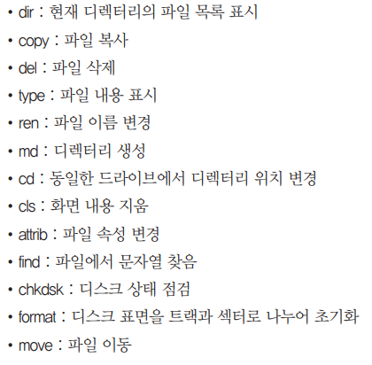
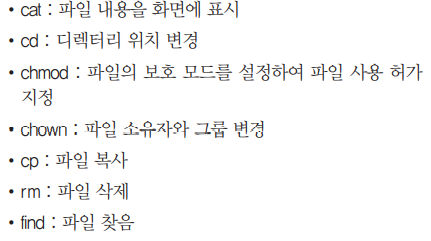
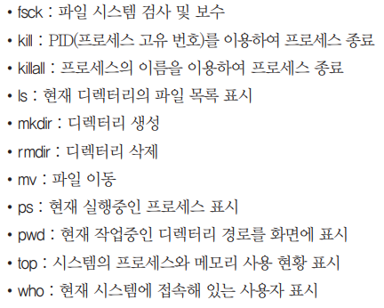
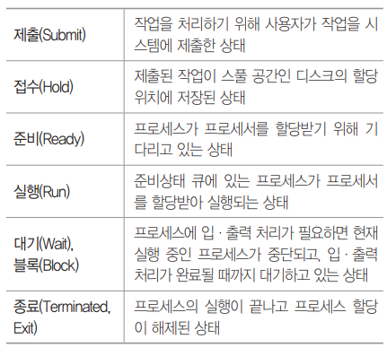
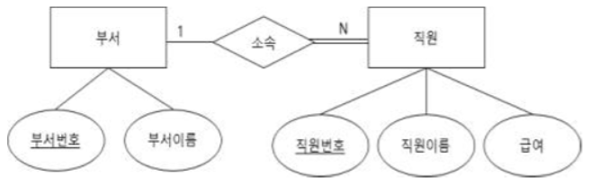

# Application_SW

### 이민아 

---

## Index

- [운영체제](#운영체제)

  - Windows

  - UNIX
  - LINUX
- [기억장치](#기억장치)
  - 가상기억장치
  - 페이징 교체 알고리즘
- [프로세스 관리](#프로세스-관리)

  - 비선점 스케줄링

  - 선점 스케줄링
- [교착상태](#교착상태)
- [DB](#db)
  - DBMS
  - 분산 데이터베이스
  - 고급 데이터베이스
- [ER](#er)
- [네트워크](#네트워크)
  - IP주소
  - IPv6
  - 도메인 네임
  - 네트워크 관련 장비
- [프로토콜](#프로토콜)
  
  - OSI 참조 모델
  -  TCP / IP
    - 응용계층
    - 전송계층
    - 인터넷계층
    - 액세스계층
  - 라우팅
- [데이터 교환 방식](#데이터-교환-방식)
  
  - 회선 교환 방식
  - 패킷 교환 방식

----

## 운영체제

### 1. 운영체제 

#### (1) Operating System (OS)

- **시스템 자원** 효율적 관리
- 사용자가 컴퓨터 편리하고 효과적으로 사용할 수 있도록 **환경** 제공하는 **여러 프로그램**의 모임

#### (2) 목적 / 성능 평가 기준

- **처리 능력** 향상 : 일정 시간 내 시스템 처리하는 **일의 양**
- **신뢰도** 향상 : 주어진 **문제** 시스템 정확하게 해결
- **사용 가능도** 향상 : 시스템 사용할 필요시 **즉시 사용 가능** 정도
- **반환 시간** 단축 : **작업 의뢰** 시간부터 **처리** 완료 시간

### 2. Winodws

#### (1) 기능

- **GUI (Graphic User Interface)** : 마우스 아이콘 메뉴

  CUI(Command User Interface) : 명령어 직접 입력

- **선점형** 멀티태스킹 : 동시에 여러 개 프로그램 실행하는 멀티태스킹을 하면서 각 작업의 CPU 이용 시간 제어하여 실행중 문제 발생하면 해당 프로그램 강제 종료 후 모든 시스템 자원 반환

- **PnP(Plug and Play)** : 하드웨어 설치시 필요 환경을 자동으로 운영체제가 구성

- **OLE(Object Linking and Embedding)** : 개체를 현재 작성 중인 문서에 자유롭게 연결하거나 삽입하여 편집할 수 있게 하는 기능

#### (2) CLI 기본 명령어

- `dir`(Windows) = `ls` (UNUX) : 파일 전체 나열
- `chkdsk` : 현재 드라이브 상태

### 3. LINUX

#### (1) 정의

- UNIX와 완벽하게 호환되며 거의 동일
- 소스코드 무료 공개
- 리누스 토발즈가 UNIX 기반 개발 운영체제

#### (2) 커널 (Kernel)

- 가장 **핵심**
- **하드웨어 보호 (캡슐화)** 
- 프로그램들과 **하드웨어** 간의 **인터페이스** 역할
- 프로세스, 기억장치, 입출력관리, 데이터 전송 및 변환 등 기능
- **주기억장치**에 적재되어 상주

#### (3) 쉘 (Shell)

- **명령어 해석기**
- 사용자의 명령어 인식하여 프로그램 호출
- 시스템과 **사용자** 간의 **인터페이스**
- DOS의 COMMAND.COM과 같은 기능

### 4. UNIX 

#### (1) 정의

- 벨 연구소, MIT, General Electric 공동 개발 운영체제
- 시분할 시스템을 위해 설계된 대홧기 운영 체제
- 소스 공개된 개방형 시스템
- C 언어로 작성되어 이식성이 높고 장치 프로세스 간 호환서 높다
- 다중 사용자
- 트리 구조 시스템

#### (2) CLI 기본 명령어 (LINUX)

- `chmod` : 파일에 대한 액세스(읽기, 쓰기, 실행) 권한 설정하여 사용자에게 제한적인 권한
- `cat` : 파일 내용 화면 표시
- `rm` : 파일 삭제
- `fsck` : 파일 시스템 검사 및 보수 무결성 검사
- `dir` (Windows) = `ls` (UNUX) : 파일 전체 나열
- `chown` : 파일 소유자 변경 

---

## 기억장치

### 1. 기억장치 관리 전략

#### (1) 정의

- **보조기억장치**의 프로그램이나 데이터를 **주기억장치에** 적재시키는 시기, 적재 위치 등을 지정하여 **공간 효율적 사용**

#### (2) 전략

- 반입 전략 (Fetch) : 보관중인 데이터 언제 적재 / 요구 반입과 예상 반입 
- 배치 전략 (Placement) : 새로 반입 데이터 어디 적재 
  - 최초 적합 (First Fit) : 빈 여역 중에서 첫번째
  - 최적 적합 (Best Fit) : 단편화 가장 적게 남기는
  - 최악 적합 (Worst Fit) : 단편화 가장 많이 남기는
- 교체 전략 (Replacement) : **페이지 교체 알고리즘**
  - FIFO (선입선출)
  - LRU (최근 가장 오랫동안 사용하지 않은 페이지)
  - LFU (최근 사용빈도가 가장 적은 페이지)

### 2. 가상기억장치 (Virtual Memory)

#### (1) 정의

- 보조기억장치(하드디스크)의 일부를 주기억장치처럼 사용
- 운영체제에서 흔히 사용되는 기법

#### (2) 구현 기법

- 페이징 기법 : 내부단편화O / 동일한 크기 분할
- 세그멘테이션 기법 : 외부단편화O / 다양한 크기 분할

#### (3) 기타 관리 사항

- 워킹셋 : 일정시간 동안 **자주 참조**하는 페이지들의 집합
- 페이지 부재 : 참조할 페이지 주기억장치에 없는 경우로 페이지부재빈도
- 스래싱 : 프로세스 처리 시간보다 페이지 교체 시간이 더 많은 경우
- 국부성(Locality)
  - 시간 구역성 : 하나의 페이지를 **일정 시간 동안** 집중적으로 액세스
  - 공간 구역성 : **일정 위치 페이지**를 집중적으로 액세스
  - 프로세스가 실행되는 동안 주기억장치를 참조할 때 **일부 페이지만 집중적으로 참조하는 성질로 워킹셋 이론의 기반**

### 3. 페이지 교체 알고리즘

#### (1) NUR (Not Used Recently)

- 최근에 사용하지 않은 페이지를 교체
- **참조비트와 변형비트** 사용

#### (2) LFU (Least Frequently Used)

- 사용**빈도가** 가장 적은 페이지 교체

#### (3) LRU (Least Recently Used)

- 최근에 **가장 오랫동안 사용하지 않은** 페이지 교체 

#### (4) SCR (Second Chance Replacement / 2차 기회 교체)

- 가장 오랫동안 주기억장치에 있던 페이지 중 **자주** 사용되는 페이지의 교페를 방지하기 위한 것으로 **FIFO 보완**

#### (5) FIFO 

- 각 페이지가 주기억장치에 적재될 때마다 그 때의 시간을 기억시켜 가장 먼저 들어와서 **가장 오래있었던** 페이지 교체

#### (6) OPT (Optimal replacement)

- **앞으로** 가장 오랫동안 사용하지 않을 페이지 교체

---

## 프로세스 관리

### 1. 프로세스

#### (1) 정의

- **프로세서(처리기, CPU)에 의해 처리**되는 사용자 프로그램, 시스템 프로그램 즉 실행중인 프로그램 의미
- 작업, 태스크
- 실기억장치에 저장된 프로그램
- PCB를 가진 프로그램
- 비동기적 행위 일으키는 주체
- 디스패치가 가능한 단위
- 프로시저가 활동중인 것

#### (2) 상태 전이 

#### (3) 상태 전이 관련 용어 ★

- **Dispatch** : 준비상태에서 **대기** 프로세스 중 하나가 프로세서 할당받아 **실행상태 전이**

- **Wake Up** : 입출력 작업 완료 후 프로세스가 **대기** 상태에서 **준비** 상태로 전이

- **Spooling** 

  - 입출력 장치의 공유 및 상대적으로 느린 입출력 장치의 처리 속도 보완하고 **다중 프로그래밍 시스템 성능** 향상

  - 직접 입출력 장치에 보내지 않고 **나중에 한꺼번에** 입출력하기 위해 **디스크에 저장**

-  타이머 런 아웃  : 실행 상태에서 **준비** 상태로 전이

- 블록  : 입출력 등 발생 으로 **대기** 상태로 전이

- Swap-in :다시 기억장치가 할당 

- Swap-out : 기억장치를 잃은 경우

### 2. 프로세스 스케줄링 

#### (1) 정의

- CPU를 사용하려고 하는 **프로세스들 사이의 우선순위**를 관리하는 작업
- 처리율과 CPU 이용률을 증가
- 오버헤드, 응답시간, 반환시간, 대기시간 을 최소화 

#### (2) 용어

- 서비스 시간  : **결과 산출**까지 소요되는 시간 
- 응답 시간 : **입력**되고 **수행 결과를 산출**하기까지 소요되는 시간 **(대기시간+수행시간)** 
- 대기시간 : 프로세스가 프로세서에 **할당 대기**까지 큐에 대기하는 시간 
- 종료 시간 
- 시간 할당량  : 프로세서 **독점**을 막기 위해 서비스되는 시간 할당량 
- 응답률 (HRN 공식)  : **(대기시간  + 서비스 시간) / 서비스 시간**  

### 3. 비선점 스케줄링 ★

#### (1) 정의

- 한 프로세스가 CPU를 할당받으면 **작업 종료 후 CPU 반환 시까지** 다른 프로세스는 **CPU 점유가 불가능한** 프로세스 방식

#### (2) 유형

- 에이징 기법
  - 시스템 특정 프로세스의 우선순위가 낮아 무한정 기다리게 되는 경우 한 번야보하거나 기다린 시간에 비례하여 **일정 시간이지나면 우선순위를 한 단계씩 높여** 나가는 기법
- 우선순위
  - 프로세스 별로 **우선순위**가 주어지고, **준비상태 큐**에서 기다리는 각 프로세스의 우선순위에 따라 CPU를 할당
  - 동일 순위는 FCFS
- 기한부
  - 작업들이 명시된 시간이나 **기한 내에 완료**되도록 계획
- FCFS (First Come First Service / 선입선출)
  - 프로세스가 **대기 큐에 도착한 순서**에 따라 CPU를 할당 
  - FIFO 알고리즘이라고도 함
- SJF (Shorteset Job Frist / 단기 작업 우선)
  - 프로세스가 도착하는 시점에 따라 그 당시 **가장 작은 서비스시간**을 갖는 프로세스가 종료 시까지 자원 점유 
  - 준비 큐 작업 중 가장 짧은 작업부터 수행, **평균 대기시간 감소** 
  - CPU 요구 시간이 긴 작업과 짧은 작업 간의 **불평등**이 심하여, CPU 요구 시간이 긴 프로세스는 **기아 현상 발생**
- HRN (Highest Response Raion Next)
  - 대기 중인 프로세스 중 현재 **응답률**이 가장 높은 것을 선택 
  - **SJF의 약점인 기아 현상을 보완**한 기법으로 긴 작업과 짧은 작업  **간의 불평등 완화** 
  - HRN의 우선순위 =**(대기시간+서비스시간) / 서비스시간**

### 4. 선점 스케줄링 ★

#### (1) 정의

- 하나의 프로세스가 cpu를 차지하고 있을때, **우선순위가 높은** 다른 프로세스가 **현재 프로세스를 중단**시키고 cpu를 점유하는 스케줄링 방식

#### (2) 유형

- 선점 우선순위
  - 준비상태 큐의 프로세스들 중에서 우선순위가 가장 높은 프로세스에게 먼저CPU 할당
- 라운드 로빈 (RR)
  - 시분할 시스템 프로세스는 같은 크기의 **CPU시간을 할당**
  - 할당 시간 내에 처리를 못하면 준비 **큐 리스트의 가장 뒤로 보내지고**
  - CPU는 대기  중인 **다음 프로세스로** 넘어감
  - **선점 FCFS(FIFO)**
- SRT (Shortest Remaining Time First)
  - **가장 짧은 시간**이 소요되는 프로세스를 먼저 수행하고, **남은 처리 시간이 더 짧다고 판단되는 프로세스가 준비 큐에 생기면 언제라도  프로세스가 선점**
  - **선점 SJF**
- 다단계 큐(MQ)
  - 작업들을 **여러 종류 그룹**으로 분할, 여러 개의 큐를 이용하여 상위단계 작업에 의한 하위단계 작업이 선점 당함 
  - 각 큐는 자신만의 독자적인 스케줄링을 가짐
- 다단계 피드백 큐(MFQ)
  - 입출력 위주와 CPU위주인 프로세스의 특성에 따라 **큐마다 서로  다른 CPU시간 할당량**을 부여 
  - **FCFS**와 **라운드 로빈** 스케줄링 기법을 혼합한 것으로, 새로운 프로세스는 높은 우선순위, 프로세스의  실행 시간이 길어질수록 점점 낮은 우선순위 큐로 이동하고 마지막  단계에는 라운드로 로빈 방식을 적용

---

## 교착상태

### 1. 교착상태

#### (1) 정의

- **상호 배제**에 의한 문제점으로 둘 이상의 프로세스들이 **자원을 점유**한 상태에서 **서로 다른** 프로세스가 점유하고 있는 자원을 **요구**하며 **무한정 대기**

#### (2) 필요충분조건

- 상호 배제
- 점유와 대기 
- 비선점
- 환형 대기

### 2. 해결방법

#### (1) 예방기법

- **사전**에 시스템 제어 (**네 가지 필요충분** 조건 중에서 어느 하나를 제거)

#### (2) 회피기법 

- 은행원 알고리즘
- 교착상태가 발생할 가능성을 배제하지 않고 발생하면 적절히 피하기

#### (3) 발견기법 

- 시스템 교착 사태 발생 점검
- 자원 할당 그래프 등 활용

#### (4) 회복기법

- 교착상태 일으킨 프로세스 종료하거나 교착 상태 프로세스에 할당된 자원 선점하여 프로세스나 자원 회복

---

## DB

### 1. DBMS (데이터베이스 관리시스템)

#### (1) DB 정의

- 정의 : 조직 업무 수행하는 데 필요한 상호 관련 데이터 모임
- 유형
  - 통합된 데이터 : 중복 최소
  - 저장된 데이터 : 컴퓨터 접근 저장 매체 저장된 데이터
  - 운영 데이터 : 고유 업무 존재가치 확실 반드시 필요
  - 공용 데이터

#### (2) DBMS 정의

- 정의
  - 사용자와 DB 사이에서 사용자 요구 따라 정보 생성 및 DB 관리 SW

- 필수 기능
  - 정의 기능 : 데이터형과 구조 정의, 이용방식, 제약조건
  - 조작 기능 : 검색, 갱신, 삽입, 삭제 (사용자와 DB 인터페이스)
  - 제어 기능 : 무결성 유지 

- 유형
  - 계층형 DBMS : 트리 구조(상위, 하위 관계) 1:N
  - 망형 : 그래프 구조 (상위, 하위 관계) 다대다까지 가능 
  - **관계형** 
    - 계층형과 망형 복잡한 구조 단순화
    - 파일처 구조처럼 2차원적 표를 하나의 DB로 묶어서 
    - 속성들 간의 관계를 설정하거나 테이블 간의 관계를 설정하여 이용

### 2. 분산 DB

#### (1) 정의

- 논리적으로 같은 시스템
- 물리적으로는 컴퓨터 네트워크로 분산

#### (2) 목표

- 위치 투명성 : 논리적 명칭으로만 접근 (실제 위치 불필요)
- 중복 투명성 : 중복되더라도 하나의 데이터만 존재하는 것처럼 
- 병행 투명성 : 다수의 트랜잭션드리 동시에 실행되더라도 결과 영향X
- 장애 투명성 : 장애에도 불구하고 트랜잭션 정확히 수행

### 3. 고급 DB ★

#### (1) 데이터 웨어하우스

- 급증하는 **다량**의 데이터를 효과적으로 분석하여 정보화
- **여러 계층** 사용자들이 효율적으로 사용할 수 있도록 한 DB

#### (2) 데이터 마트

- 전사적으로 구축된 데이터 웨어하우스로부터 **특정 주제나 부서** 중심으로 구성된 **소규모 단일 주제의 데이터 웨어하우스**

#### (3) 데이터 마이닝

- 웨어하우스에 저장된 데이터 집합에서 **사용자의 요구**에 따라 **유용하고 가능성** 있는 정보를 **발견**하기 위한 기법

#### (4) OLAP (Online Analytical Processing)

- **다차원**으로 이루어진 데이터로부터 **통계적 요약 정보** 분석

#### (5) OLTP (Online Transaction Processing)

- 온라인업무 처리 형태의 하나로 네트워크상의 **여러 이용자가 실시간**으로 DB 데이터 **갱신 혹은 검색**

### 4. RDBMS (관계 데이터베이스)

#### (1) 정의

- 릴레이션 : 데이터들을 표의 형태로 표현한 것
- 스키마
- 인스턴스 : 실제값

#### (2) 구조

- 튜플 (행) : Record / 카디널리티 / 기수 / 대응수

- 속성 (열) : Field  / 디그리 / 차수

- 도메인 : 하나의 **속성**이 취할 수 있는 같은 타입의 원자값들의 집합, 실제 속성 값이 나타날 때 그 값의 합법 여부를 시스템이 검사하는 데도 사용

  ex : 호봉의 속성을 1에서 6으로 제한

- 인스턴스 : 개체를 구성하는 속성들에 데이터타입이 정의되어 구체적인 값을 가진 상태

  

### 5. 키 개념 ★

#### (1) 정의

- DB 조건에 만족하는 튜플을 찾거나 순서대로 정렬하는 기준이 되는 속성

#### (2)  유형

- 슈퍼키 : 한 릴레이션 내에 있는 속성들의 집합으로 구성된 키 (유일성O 최소성X)
- **후보키** : 릴레이션 구성하는 속성들 중에서 유일하게 튜플을 식별하기 위해 **(유일성O 최소성O)**
- 기본키 : **후보키 중에서** 특별히 선정된 키로 **중복된 값과 NULL값 불가**
- 대체키 : **후보키 중에서** 기본키 제외한 나머지 후보키
- **외래키** : 다른 릴레이션의 기본키를 참조하는 속성 또는 속성들의 집합 (릴레이션 간 관계)

### 6. 무결성 ★

#### (1) 정의

- 데이터베이스에 **저장**된 값과 그것이 표현하는 현실 세계의 **실제**값이 일치하는 정확성

#### (2) 유형

- **개체 무결성(실체 무결성)** : 기본 테이블의 **기본키**를 구성하는 어떤 속성도 **Null값이나 중복값 불가**
- 도메인 무결성(영역 무결성) : 주어진 속성 값이 정의된 도메인에 속한 값이어야 한다는 규정
- **참조 무결성** : **외래키값**은 **Null값**이거나 참조 릴레이션의 **기본키 값과 동일**해야 함 (참조할 수 없는 외래키를 가질 수 없다)
- 사용자 정의 무결성 : 사용자가 정의한 제약 조건에 속성값들이 만족
- NULL 무결성 : 릴레이션 **특정 속성** 값이 NULL이 될 수 없도록 하는 규정
- **고유 무결성** : 릴레이션의 **특정 속성**에 대해 **각 튜플이 갖는 속성값들이 서로 달라야 한다**
- 키 무결성 : 하나의 릴레이션에는 **적어도 하나의 키**가 존재해야 한다는 규정
- 관계 무결성 : 릴레이션에는 어느 **한 튜플**의 **삽입 가능 여부** 또는 다른 릴레이션의 **튜플들** 사이의 **관계**에 대한 적절성 여부 지정한 규정

---

## ER

### 1. ER 도형

#### (1) 정의

- 피터 첸에 의해 제안
- 데이터 **모델링**

#### (2) 도형

- 다이아몬드 : **관계** 타입
- 사각형 : **객체** 타입
- 타원 : **속성**
- 선 : 속성과 개체 집합 연결, 개체 집합과 관계 연결
- 타원 + 밑줄 : 기본키

### 2. ER 관계 및 관계 타입

#### (1) 정의

- 관계 : 2개 이상의 개체 사이에 존재하는 연관성
- 관계타입 : 같은 관계들의 집합 또는 틀

#### (2) 유형

- 차수에 따른 관계의 종류
  - 참여하는 개체 타입의 개수에 대한 차수
  - 단항, 이항, 삼항, n항
- 대응 카디널리티에 따른 종류
  - 참여하는 **개체 어커런스의** 개수에 대한 **대응 카디널리티**
  - **1:1, 1:N, 다대다**

#### (3) 관계형 데이터 모델로 변환

- **개념적** 데이터 모델 : **ER 모델**
- **논리적** 데이터 모델 : 릴레이션 스키마

---

## 네트워크

### 1. 

#### (1) 정의

#### (2) 

### 2. 

#### (1) 정의

#### (2) 

---

## 프로토콜

### 1. 

#### (1) 정의

#### (2) 

### 2. 

#### (1) 정의

#### (2) 

### 3. 

#### (1) 정의

#### (2) 

### 4. 

#### (1) 정의

#### (2) 

### 5. 

#### (1) 정의

#### (2) 

### 6. 

#### (1) 정의

#### (2) 

### 7. 

#### (1) 정의

#### (2) 

---

## 데이터 교환 방식

### 1. 

#### (1) 정의

#### (2) 

### 2. 

#### (1) 정의

#### (2) 

---

## References

- 시나공 정보처리기사 실기 대비용 핵심요약

---

